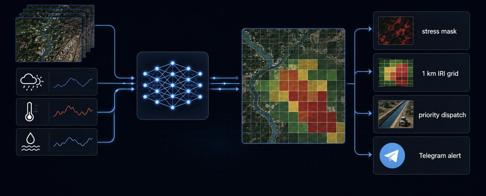
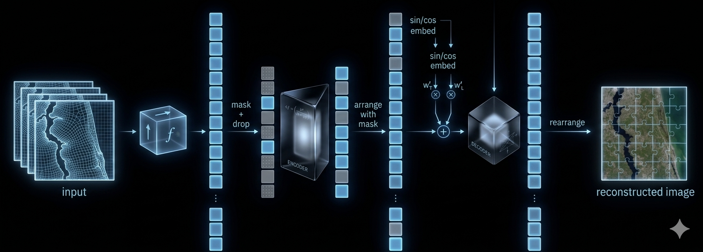
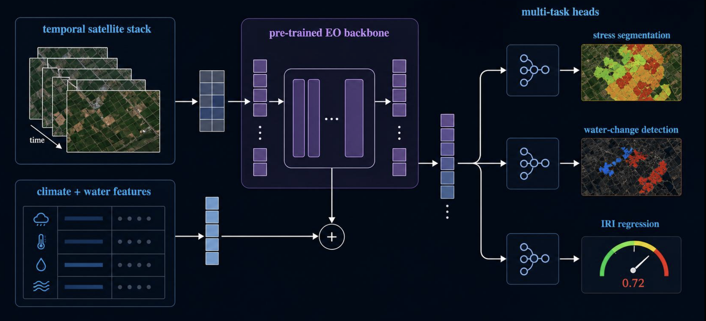

# FALAK — Demo sayti

Django + Channels asosidagi veb-ilova: **FALAK** sun'iy yo'ldosh modelining
**Farg'ona vodiysi, O'zbekiston** uchun sug'orish xavfi natijalarini namoyish qiladi.

- **Bosh sahifa** — yetti bo'limli marketing sahifa: muammo → yechim → ma'lumotlar → model → mahsulot → nima uchun → CTA.
- **Boshqaruv paneli** — Leaflet xaritada **1 km Sug'orish Xavfi Indeksi (IRI)** tarmog'i. Istalgan katakni bosing va uning statistikasini ko'ring (NDVI, tuproq namligi, ET, yog'in anomaliyasi, eng yaqin daryo va h.k.).
- **"Suv" chati** — WebSocket orqali Groq'ga ulangan suhbat (standart model: `llama-3.3-70b-versatile`). Har bir javob **tanlangan katakning statistikasiga** asoslanadi. Nima ekish, qaysi zararkunandalardan ehtiyot bo'lish, qachon sug'orish kerakligi, qaysi yovvoyi hayvonlar zarar yetkazishi haqida so'rashingiz mumkin — javoblar katakning haqiqiy raqamlarini keltiradi. Standart javob tili — **O'zbek**; rus yoki ingliz tilida savol berilsa, shu tilda javob beradi.
- **ML mock servisi** — deterministik, fazoda muvofiq IRI / NDVI / namlik generatori. Tayyor model bo'lganda uni almashtirish mumkin.

---

## Tezkor boshlash

```bash
# 1. Virtual muhit yaratish va kutubxonalarni o'rnatish
python3 -m venv .venv
source .venv/bin/activate
pip install -r requirements.txt

# 2. Muhit faylini sozlash
cp .env.example .env
# .env'ni tahrirlang va GROQ_API_KEY'ni kiriting (ixtiyoriy — kalitsiz demo rejimi ishlaydi)

# 3. Migratsiyalarni ishga tushirish (faqat sessiyalar uchun)
python manage.py migrate

# 4. ASGI serverni ishga tushirish (Daphne — WebSocket uchun zarur)
daphne -b 0.0.0.0 -p 8000 falak.asgi:application
#  yoki rivojlantirish rejimida:
python manage.py runserver 0.0.0.0:8000
```

Bosh sahifa uchun <http://localhost:8000/>, panel uchun <http://localhost:8000/dashboard/>.

> **Groq kaliti bo'lmasa**, chat **demo rejimida** ishlaydi — tanlangan katak ma'lumotlariga asoslangan, deterministik, foydali javoblar (O'zbek tilida) qaytaradi. UI to'liq sinaladi.
>
> **Kalit bo'lsa**, `.env` faylida `GROQ_API_KEY`ni o'rnating. Bepul kalitni <https://console.groq.com/keys> manzilidan oling. Standart model `llama-3.3-70b-versatile` (`GROQ_MODEL` orqali o'zgartirish mumkin).

---

## Loyiha tuzilishi

```
falak_site/
├── manage.py
├── requirements.txt
├── .env.example
├── falak/                 ← Django loyihasi
│   ├── settings.py
│   ├── asgi.py            ← ASGI: HTTP + WebSocket marshrutlash
│   ├── routing.py         ← ws/chat/ → ChatConsumer
│   └── urls.py
├── core/                  ← bosh sahifa ilovasi
│   ├── views.py
│   └── templates/core/landing.html
├── dashboard/             ← "panelni sinash" ilovasi
│   ├── views.py           ← sahifa + REST endpoint'lar
│   ├── urls.py
│   ├── consumers.py       ← WebSocket chat consumer
│   ├── ai_client.py       ← async Groq oqim wrapper
│   ├── ml_mock.py         ← har bir katak uchun IRI / NDVI / namlik mock generatori
│   ├── regions.py         ← Farg'ona tumanlari + daryo anchor'lari
│   └── templates/dashboard/dashboard.html
├── templates/base.html
└── static/
    ├── css/{base,landing,dashboard}.css
    ├── js/{landing,map,stats,chat,dashboard}.js
    └── img/{hero.jpg, workflow.png, architecture.png, VFM.png}
```

---

## Hammasi qanday birlashadi

1. **Xarita** (`static/js/map.js`)
   - Leaflet, Farg'ona ustida joylashgan (40.65, 71.75), zoom 9.
   - Har bir katak uchun rangli 1 km tarmoqni tezkor mijoz tomonidagi `previewScore` funksiyasi orqali chizadi (server tomonidagi generator bilan to'liq mos keladi — ranglar API qaytaradigan raqamlar bilan birxil).
   - Katak bosilganda `GET /dashboard/api/cell/?lat=…&lng=…` orqali to'liq statistikani oladi.
2. **Statistika qatori** (`static/js/stats.js`)
   - Olti karta: Stress darajasi, NDVI, Tuproq namligi, 30 kunlik yog'in, Harorat, Bug'lanish (ET) — har biri 30 kunlik Chart.js sparkline bilan.
3. **Chat paneli** (`static/js/chat.js`)
   - `/ws/chat/`ga WebSocket ulanadi.
   - Katak tanlanganda `{type: "select_cell", stats}` yuboradi — server modelni shu raqamlarga asoslantirib turishi uchun.
   - Foydalanuvchi matni `{type: "user_message", text}` orqali yuboriladi va oqim sifatida kelgan `ai_chunk`'lar bubble ichida ko'rsatiladi.
4. **Consumer** (`dashboard/consumers.py`)
   - Async `AsyncJsonWebsocketConsumer`.
   - `cell_stats`ni scope ichida saqlaydi; har bir foydalanuvchi xabariga `CELL_STATS` JSON blokini prefiks qiladi — shunda model javobi har doim tanlangan katakning raqamlarini keltiradi.
5. **AI mijoz** (`dashboard/ai_client.py`)
   - `groq` SDK (`AsyncGroq.chat.completions.create(..., stream=True)`) ishlatadi.
   - Batafsil O'zbek tilidagi `SYSTEM_INSTRUCTION` — Farg'ona ekinlari, mintaqaviy zararkunandalar, hayvonlar, sug'orish mantiqi haqida.
   - Kalit bo'lmasa O'zbek tilida graceful fallback javob — tashqi chaqiriqsiz demo ishlashda davom etadi.
   - Provayderni keyinroq almashtirish uchun (OpenAI, Anthropic, va h.k.) faqat shu bitta faylni almashtiring — `consumers.py` faqat `get_client()` va `stream()` interfeysi orqali muloqot qiladi.

---

## ML model tuzilishi — FALAK-VFM

> **FALAK-VFM** (Vision Foundation Model) — Farg'ona vodiysi uchun **sug'orish xavfini bashorat qiluvchi** ko'p vazifali sun'iy yo'ldosh asos modeli. Sun'iy yo'ldosh tarixi + ob-havo + suv ta'minoti → Sug'orish Xavfi Indeksi (IRI).

Quyidagi to'qqiz kichik bo'lim modelning to'liq hayot siklini ko'rsatadi: umumiy ish jarayonidan tortib, asos modelning o'qitilishi, aniq sozlash, vaqt bo'yicha sinov va chiqarilgan mahsulotlargacha.

### 1 · Umumiy oqim — ma'lumotdan harakatgacha

<p align="center">
  
</p>

Chap tomondagi ma'lumot oqimlari — **sun'iy yo'ldosh tarixi** (Sentinel-2 optik tasvirlar), **ob-havo** (harorat, yog'in, namlik), **suv ta'minoti** (kanal va daryo tarmog'i) — bularning hammasi yagona neyron tarmoqqa kiritiladi. Tarmoq ularni o'rtadagi **1 km Sug'orish Xavfi Indeksi (IRI)** issiqlik xaritasiga aylantiradi. O'ng tomonda esa to'rt amaliy mahsulot ajraladi:

- **Stress maskasi** — qaysi piksellarda ekin stressi bor
- **1 km IRI tarmog'i** — har bir katak uchun [0, 1] xavf balli
- **Ustuvor dispetcher** — qaysi tumanlarni avval sug'orish kerakligi
- **Telegram ogohlantirish** — fermerga 72 soatlik tekshiruv xabari

Bu darajada FALAK xom ma'lumotni dala harakatiga aylantiruvchi **boshqaruv qatlami**dir.

### 2 · Ma'lumot manbalari (yetti ochiq Yer kuzatuv oqimi)

Hammasi Google Earth Engine orqali yig'iladi va 1 km tarmoqqa moslashtiriladi.

| Manba              | Toifa       | Qarori         | Maqsadi                                     |
|--------------------|-------------|----------------|---------------------------------------------|
| **Sentinel-2**     | Optik       | 10 m · 5 kun   | NDVI, NDMI, NDWI — o'simlik / namlik indekslari |
| **Sentinel-1**     | SAR         | 10 m · 6 kun   | Bulutdan o'tuvchi backscatter — yuza namligi |
| **SMAP**           | Tuproq      | L3 · 9 km      | L-band passiv radiometr tuproq namligi      |
| **CHIRPS**         | Yog'in      | 5 km · kunlik  | 1981→ kunlik yog'in, anomaliya bazasi       |
| **ERA5**           | Ob-havo     | 31 km · soatlik| Harorat, shamol, namlik, quyosh radiatsiyasi|
| **WaPOR · MODIS**  | Bug'lanish  | 100 m / 500 m  | Haqiqiy evapotranspiratsiya (ET)            |
| **OSM · HydroRIVERS** | Gidrologiya | vektor      | Kanal va daryo tarmog'i; suvgacha masofa    |

### 3 · Xususiyatlar do'koni (Feature Store)

Manbalar quyidagi to'qqiz xususiyatlar guruhiga aylantiriladi:

- **Vegetatsiya** — NDVI / NDMI / NDWI vaqt qatorlari, mavsumiy normalar, anomaliya
- **Namlik** — SMAP + SAR backscatter, fazoda joylashtirilgan
- **Yog'in** — kunlik to'plangan, 30 kunlik to'plam, anomaliya foizi
- **Harorat** — ERA5 soatlik → kunlik agregat
- **ET (bug'lanish)** — WaPOR + MODIS; suv talab tomoni
- **Suv ob'ektlari** — Sentinel-1 + OSM dan ajratilgan
- **Topografiya** — DEM dan balandlik, qiyalik
- **Sug'orish signallari** — kanal yaqinligi, irrigatsiya tarixi
- **Gidrologiya** — eng yaqin daryo / kanalgacha bo'lgan masofa

Har bir 1 km × 1 km katak ushbu xususiyatlar vektorini oladi (multi-temporal stack).

### 4 · Asos modeli — Masked Autoencoder oldindan o'qitilgan

<p align="center">
  
</p>

FALAK-VFM asos modeli **o'z-o'zini nazorat qiluvchi o'rganish** (self-supervised learning) orqali oldindan o'qitiladi. Bu **niqoblangan avtoenkoder** (Masked Autoencoder, MAE) sxemasi — diagrammada chap-o'ng tartibida ko'rinadi:

1. **Input** — Sentinel-2 patchlari to'plami modelga kiritiladi.
2. **Mask drop** — patchlarning 75% qismi tasodifiy yashiriladi. Model faqat qolgan 25% ni ko'radi.
3. **Embed + arrange** — ko'rinadigan patchlar transformer encoderga kiritiladi; sin/cos pozitsion embedlar qo'shiladi.
4. **Rearrange + reconstruct** — yashirilgan patchlar boshqa transformer (decoder) yordamida qayta tiklanadi.
5. **Reconstructed image** — model butun tasvirni faqat 25% asosida qayta tiklashga o'rganadi.

Bu rejimning kuchi — **yorliqlangan dala ma'lumoti talab qilmaydi**. Petabaytlab xom Sentinel tasvirlar ustida ishlaydi va keyin sug'orish vazifalari uchun aniq sozlanadi (fine-tuning). NASA va IBM tomonidan ochiq qilingan **Prithvi-EO** asos modeli aynan shu yondashuvni qo'llaydi; FALAK-VFM uni o'zagi sifatida ishlatadi.

### 5 · FALAK-VFM arxitekturasi — ko'p vazifali aniq sozlash

<p align="center">
  
</p>

Asos modeli o'qitib bo'lingach, FALAK uchun aniq sozlanadi. Arxitektura ikki kirish oqimini birlashtiradi:

**Yuqori oqim — sun'iy yo'ldosh stack'i**  
To'rt vaqt kadri × oltita Sentinel-2 spektral bandi (multi-temporal stack) **oldindan o'qitilgan EO o'zak** (pre-trained Earth Observation backbone) orqali o'tadi. Bu o'zak — 4-bo'limdagi MAE rejimida o'qitilgan transformer.

**Pastki oqim — iqlim va suv xususiyatlari**  
Harorat, yog'in, namlik, ET kabi jadval xususiyatlari ko'p qatlamli perceptron (Climate + Water MLP) orqali kompakt vektorga aylanadi.

**Fusion (`+` belgisi)**  
Yuqori va pastki oqimlar yagona yashirin vakillikka birlashadi.

**Ko'p vazifali boshlar (multi-task heads)**  
Bitta umumiy vakillikdan bir nechta vazifa boshi ajraladi:

| Bosh                          | Chiqishi                                                |
|-------------------------------|----------------------------------------------------------|
| **Stress segmentatsiyasi**    | Piksel darajasidagi rangli ekin stress xaritasi          |
| **Suv-o'zgarish aniqlanishi** | Suv ob'ektlari va kanal anomaliyalari maskasi            |
| **Kelajak namlik**            | Keyingi 7–14 kun uchun tuproq namligi bashorati          |
| **IRI regressiyasi**          | Har bir 1 km katak uchun [0, 1] IRI balli (gauge ko'rsatkichi) |
| **Ustuvor sinf**              | YUQORI / O'RTACHA / PAST tartiblash sinflari             |

Ko'p vazifali rejimning kuchi — bitta umumiy vakillik bir nechta vazifalarni birgalikda o'rganadi, har bir vazifa boshqasiga foyda keltiradi (positive transfer).

### 6 · O'qitish — vaqt bo'yicha sinov

Standart train/test split o'rniga, **vaqt bo'yicha sinov** (time-travel backtest) qo'llaniladi: model **o'tmish ma'lumotlari** asosida o'qitiladi, **kelajakni** bashorat qiladi, keyin haqiqiy kelajak sun'iy yo'ldosh dalillariga solishtiriladi.

```
2018──2019──2020──2021──2022 │ 2023 │ 2024──2025
       O'QITISH                TEK.   SINOV (backtest)
```

| Bosqich          | Yillar      | Maqsad                                         |
|------------------|-------------|------------------------------------------------|
| **O'qitish**     | 2018–2022   | Asosiy model va boshlarni o'rgatish            |
| **Tekshirish**   | 2023        | Giperparametr tanlash, kalibratsiya            |
| **Sinov**        | 2024–2025   | Kelajak ma'lumotlarida ishlash baholash        |

### 7 · Maydon belgisiz o'qitish (Weak Labeling)

Farg'ona vodiysida ekin-by-ekin yorliqlangan ma'lumotlar yo'q. Shuning uchun **kelajak sun'iy yo'ldosh dalillaridan** kuchsiz yorliqlar yaratiladi:

```
Vaqt t'da:                        Vaqt t+10'da:
  – NDMI tushishi                   – Yorliq: STRESS DARAJASI
  – NDWI tushishi                 → – LOW / MEDIUM / HIGH
  – Yog'in defitsiti                 (LABEL ENGINE birlashtiradi)
  – Issiqlik / ET talab
  – Ekin maskasi
```

Model `t` paytidagi xususiyatlardan keyingi 7–14 kunni bashorat qiladi.  
`t+10`'da haqiqiy sun'iy yo'ldosh dalillari kelganda, ular kuchsiz yorliq sifatida ishlatiladi va modelni qayta o'qitish uchun fid-bek bo'ladi.

### 8 · Metrikalar

| Metrika              | Nimani o'lchaydi                                     |
|----------------------|------------------------------------------------------|
| **IoU**              | Stress segmentatsiyasi sifati (Intersection over Union) |
| **F1**               | Klassifikatsiya boshlari uchun                       |
| **Precision@10%**    | Eng yuqori 10% katakda aniqlik (dispetcher uchun muhim) |
| **MAE**              | IRI regressiyasi xatosi                              |
| **Kalibratsiya**     | Bashorat ehtimolligi haqiqatga qanchalik to'g'ri keladi |

### 9 · Chiqish mahsulotlari

Model natijasidan dala harakatigacha to'rt qadam:

1. **Xavf xaritasi** — 1 km issiqlik xaritasi, IRI bo'yicha rangli
2. **Ustuvor ro'yxat** — tumanlar xavf ostidagi gektarlar bo'yicha tartiblanadi  
   (masalan: Quva YUQORI 1,250 ga · Yozyovon YUQORI 980 ga · Rishton O'RTACHA 870 ga …)
3. **AI hisoboti** — har bir tuman uchun tekshiruv oynasi va aniq harakatlar
4. **Telegram ogohlantirish** — fermerga: "Quva — YUQORI xavf · 72 soat ichida tekshiring"

---

## Haqiqiy modelga o'tish

`dashboard/ml_mock.py:compute_cell(lat, lng)` funksiyasini real FALAK-VFM inferens servisingizga chaqiruv bilan almashtiring. Kontrakt — bitta dict shaklida:

```python
{
    "id": "UZB_…",
    "lat": 40.62, "lng": 71.74, "bounds": {…},
    "district": "Quva", "oblast": "Farg'ona", "area_ha": 100,
    "iri_score": 0.78, "stress_class": "HIGH",
    "priority_class": "HIGH", "inspection_window_h": 72,
    "ndvi": 0.42, "ndmi": 0.18, "ndwi": -0.12,
    "soil_moisture_pct": 14.3,
    "rainfall_30d_mm": 8.2, "rainfall_anomaly_pct": -62,
    "temperature_c": 28.4, "et_mm_day": 5.9,
    "elevation_m": 412, "distance_to_water_km": 4.8,
    "nearest_water": "Janubiy Farg'ona kanali",
    "dominant_crop": "Paxta",
    "history": {
        "ndvi": [...30 kun],
        "moisture": [...],
        "rainfall": [...],
        "temperature": [...],
        "et": [...],
    },
}
```

Stack ichida boshqa hech narsani o'zgartirish kerak emas — front-end aynan shu kalitlarga bog'langan.

**Eslatma — ikki tomonlama formula sinxronizatsiyasi:**  
`dashboard/ml_mock.py::compute_cell` formulasi mijoz tomonida `static/js/map.js::previewScore`'da ham aks ettirilgan (xarita preview rangi tezkor bo'lishi uchun). Birini o'zgartirsangiz, ikkinchisini ham yangilang — aks holda hover qilingan katak rangi bosilgan katak statistikasi bilan mos kelmay qoladi.

---

## Joylashtirish izohlari

- **Daphne** (yoki Uvicorn) — sof WSGI emas, ASGI server kerak. WebSocket uchun zarur.
- Productionda `InMemoryChannelLayer`'ni `channels-redis`'ga almashtiring va Redis servisini qo'shing (`InMemoryChannelLayer` faqat bitta jarayonda ishlaydi — bir nechta Daphne worker chat holatini bo'lishmaydi).
- `WhiteNoise` allaqachon ulangan; deploy oldidan `python manage.py collectstatic` ishga tushiring.
- `.env`'da `DEBUG=False`, to'g'ri `ALLOWED_HOSTS` va haqiqiy `SECRET_KEY` o'rnating.
- DEBUG=False bo'lganda WebSocket ulanishlari `AllowedHostsOriginValidator` orqali tekshiriladi — Origin header'siz so'rovlar rad etiladi.

---

## Litsenziya

MIT. FALAK · 2026.
